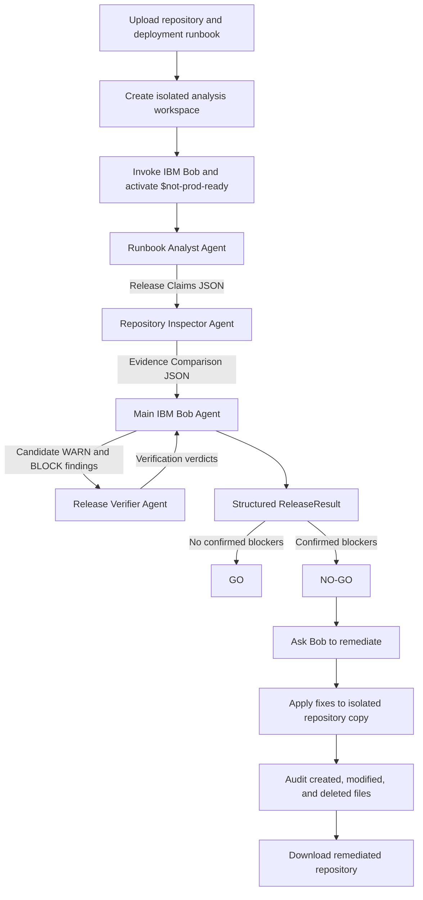

# NOTPRODREADY

**Release readiness before production.**

Built for the **IBM Dev Day Hackathon (August 2026 / Developer Productivity with IBM Bob 2.0).**

[Watch the 3-minute demo](https://youtu.be/YOUR_VIDEO_ID) · [Try the live demo](https://notprodready.onrender.com/) · [Judge's Quick Guide](./JUDGE.md)

---

## Problem

According to [IBM’s Bendigo and Adelaide Bank case study](https://www.ibm.com/case-studies/bendigo-adelaide-bank), the bank experienced process bloat, extensive manual intervention, and difficulty delivering applications quickly enough to meet customer expectations. New application environments typically required **five weeks** to deliver, while thousands of spreadsheets were used to manage processes across the organization.

[IBM also reports that Daimler Trucks North America relied on a manual deployment document containing more than 30 steps](https://www.ibm.com/case-studies/daimler-trucks-north-america). Deployments required **60–90 minutes**, there was no clear automated rollback path, and limited source-control traceability increased the possibility of deployment errors.

These are not isolated coding problems. A deployment runbook may require one runtime version while the repository requires another. A production startup command may no longer exist. Environment variables may be undocumented, migration procedures may be incomplete, or rollback instructions may not match the application being released.

The challenge is not simply finding issues in source code. It is determining whether the repository, deployment documentation, and actual production requirements agree with one another before a release reaches production. Without an automated way to verify that agreement, engineering teams depend on manual checklists, fragmented evidence, and assumptions that may already be outdated.

## Solution

**NotProdReady** is an IBM Bob-native release-readiness platform that transforms a deployment runbook and repository archive into an auditable **GO** or **NO-GO** production decision.

Its custom **`$not-prod-ready` Bob-native Skill** coordinates a multi-agent workflow in which a **Runbook Analyst Agent** extracts the documented release requirements, a **Repository Inspector Agent** independently searches for corresponding technical evidence, and a **Release Verifier Agent** challenges proposed blockers and warnings before they become part of the final result.

The workflow produces a structured `ReleaseResult` containing a readiness score, confirmed blockers, warnings, passed checks, supporting evidence, recommended actions, and agent activity.

For a **NO-GO** result, the developer can select **Ask Bob to remediate**. IBM Bob receives write access only to an isolated copy of the uploaded repository, applies targeted corrections to confirmed findings, and records every file that was created, modified, or deleted. The original repository and original analysis remain unchanged. After reviewing the audited change set, the developer downloads the remediated repository as a ZIP archive.

NotProdReady replaces a manual, trust-based deployment checklist with an evidence-driven IBM Bob workflow that helps engineering teams identify production risk before production does.

## How it works



1. A developer uploads an application repository, deployment runbook, application name, release version, and target environment.

2. The NotProdReady FastAPI backend creates an isolated workspace with separate `documents/`, `repository/`, and `output/` directories.

3. The backend invokes **IBM Bob through Bob Shell**, authenticated at runtime using `BOB_API_KEY`, and activates the custom **`$not-prod-ready` Bob-native Skill**. Bob execution events are streamed to the application as the workflow progresses.

4. The main IBM Bob agent launches the **Runbook Analyst Agent** with read-only access to the deployment documentation. The agent extracts the intended release contract and returns structured **Release Claims JSON** containing:

   - Runtime and version requirements
   - Build and startup commands
   - Application ports
   - Required environment variables
   - Migration instructions
   - Rollback instructions

5. The Release Claims JSON flows to the **Repository Inspector Agent**. This agent receives read-only access to the repository and searches specifically for technical evidence corresponding to each documented requirement.

6. The Repository Inspector Agent returns **Evidence Comparison JSON** containing:

   - The documented runbook claim
   - The actual repository value
   - The supporting source file
   - The exact evidence, pattern, absence, or command
   - The resulting agreement or mismatch

7. The main IBM Bob agent compares the documented release claims with the repository evidence and creates candidate **PASS**, **WARN**, and **BLOCK** findings.

8. PASS findings are accepted without additional review. Only candidate WARN and BLOCK findings flow to the **Release Verifier Agent**, together with the targeted evidence paths supporting each finding.

9. The Release Verifier Agent independently classifies every candidate as:

   - **CONFIRMED** — the finding is supported by the available evidence.
   - **REJECTED** — the finding is a false positive and becomes PASS.
   - **INSUFFICIENT EVIDENCE** — the finding cannot be conclusively verified and becomes WARN.

10. The verification results flow back to the main IBM Bob agent. Confirmed findings retain their proposed severity, rejected findings become PASS, and findings with insufficient evidence become WARN.

11. The main IBM Bob agent calculates the readiness score:

    ```text
    score = 100 - (confirmed blockers × 20) - (warnings × 5)
    ```

12. A release receives **NO-GO** when at least one confirmed BLOCK finding exists. If no confirmed blockers remain, the release receives **GO**.

13. Bob writes the complete machine-readable result to `output/release-result.json`. The backend validates this artifact and presents the decision, readiness score, confirmed findings, passed checks, supporting evidence, recommended actions, and agent activity.

14. For a NO-GO result, the developer can select **Ask Bob to remediate**. Bob resumes the release context and applies targeted corrections inside an isolated copy of the repository.

15. NotProdReady compares SHA-256 file manifests to identify every created, modified, or deleted file. The developer reviews this audited change set and downloads the remediated repository as a ZIP archive. The original repository remains unchanged.
