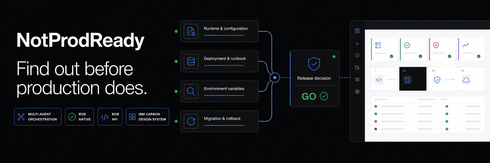
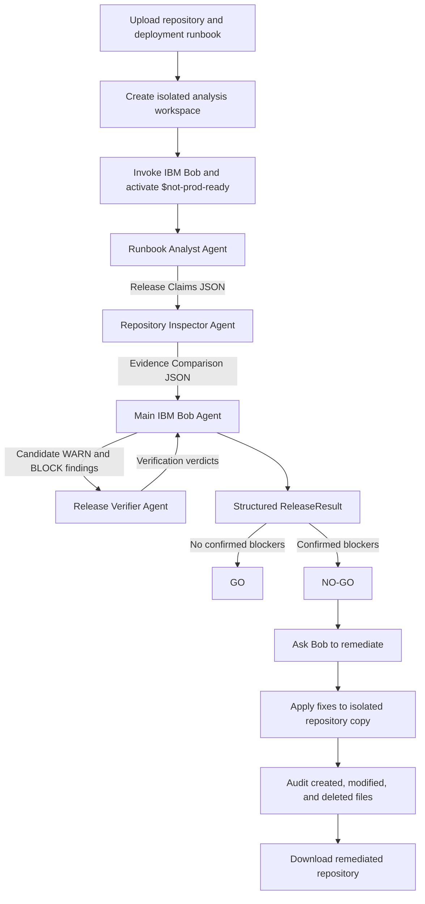
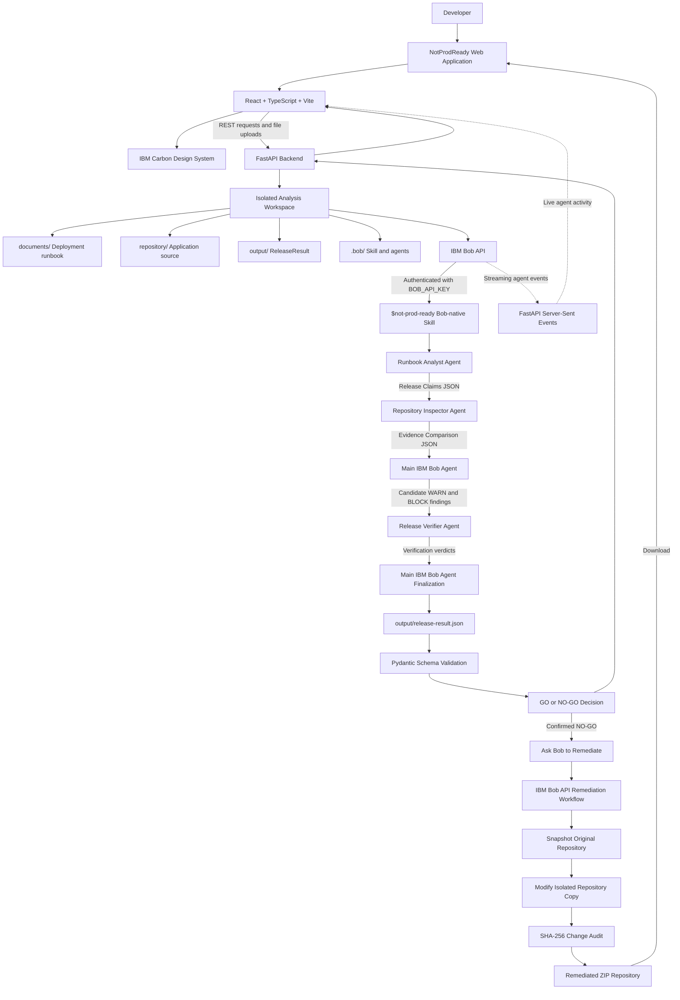

# NOTPRODREADY

**Release readiness before production.**

Built for the **IBM Dev Day Hackathon (August 2026 / Developer Productivity with IBM Bob 2.0).**

[Watch the 3-minute demo](https://youtu.be/YOUR_VIDEO_ID) · [Try the live demo](https://notprodready.onrender.com/) · [Judge's Quick Guide](./JUDGE.md)

---

## Problem

According to [IBM’s Bendigo and Adelaide Bank case study](https://www.ibm.com/case-studies/bendigo-adelaide-bank), the bank experienced process bloat, extensive manual intervention, and difficulty delivering applications quickly enough to meet customer expectations. New application environments typically required **five weeks** to deliver, while thousands of spreadsheets were used to manage processes across the organization.

[IBM also reports that Daimler Trucks North America relied on a manual deployment document containing more than 30 steps](https://www.ibm.com/case-studies/daimler-trucks-north-america). Deployments required **60–90 minutes**, there was no clear automated rollback path, and limited source-control traceability increased the possibility of deployment errors.

These are not isolated coding problems. A deployment runbook may require one runtime version while the repository requires another. A production startup command may no longer exist. Environment variables may be undocumented, migration procedures may be incomplete, or rollback instructions may not match the application being released.

The challenge is not simply finding issues in source code. It is determining whether the repository, deployment documentation, and actual production requirements agree with one another before a release reaches production. Without an automated way to verify that agreement, engineering teams depend on manual checklists, fragmented evidence, and assumptions that may already be outdated.

## Solution

**NotProdReady** is an IBM Bob-native release-readiness platform that transforms a deployment runbook and repository archive into an auditable **GO** or **NO-GO** production decision.

Its custom **`$not-prod-ready` Bob-native Skill** coordinates a multi-agent workflow in which a **Runbook Analyst Agent** extracts the documented release requirements, a **Repository Inspector Agent** independently searches for corresponding technical evidence, and a **Release Verifier Agent** challenges proposed blockers and warnings before they become part of the final result.

The workflow produces a structured `ReleaseResult` containing a readiness score, confirmed blockers, warnings, passed checks, supporting evidence, recommended actions, and agent activity.

For a **NO-GO** result, the developer can select **Ask Bob to remediate**. IBM Bob receives write access only to an isolated copy of the uploaded repository, applies targeted corrections to confirmed findings, and records every file that was created, modified, or deleted. The original repository and original analysis remain unchanged. After reviewing the audited change set, the developer downloads the remediated repository as a ZIP archive.

NotProdReady replaces a manual, trust-based deployment checklist with an evidence-driven IBM Bob workflow that helps engineering teams identify production risk before production does.
## How IBM Bob Was Used

IBM Bob was used in two fundamental ways: as the development partner that helped build NotProdReady and as the agentic runtime that powers the product itself.

### 1. IBM Bob as the development partner

Kazi Tasin used **IBM Bob 2.0** throughout the project’s development. Bob contributed directly to the application rather than being used only for ideation or documentation. 
Kazi Tasin leveraged features like Agent mode, subagent, MCP, custom made skills (not-prod-ready).

Bob assisted with:

- Building and refining the React and IBM Carbon user interface
- Creating the release results, evidence, findings, and agent-activity views
- Implementing the FastAPI analysis backend and Server-Sent Events pipeline
- Integrating the application with IBM Bob Shell and the IBM Bob API
- Creating the custom **`$not-prod-ready` Bob-native Skill**
- Creating the Runbook Analyst, Repository Inspector, and Release Verifier agents
- Defining and validating the structured `ReleaseResult` contract
- Stabilizing real Bob task execution and final-result generation
- Implementing the remediation and revalidation workflow
- Debugging authentication, routing, analysis-progress, and end-to-end workflow regressions
- Running builds, backend tests, integration checks, and zero-Bobcoin preflight validation

Bob also created and used the project-level **`design-advisor` MCP server** to obtain additional IBM Carbon and React interface feedback during development.

The exported IBM Bob task sessions are included in [`bob_sessions/`](./bob_sessions/):

| Session | IBM Bob contribution |
|---|---|
| [`01-overhaul-carbon-ui-ux.md`](./bob_sessions/01-overhaul-carbon-ui-ux.md) | Complete product-wide IBM Carbon UI/UX overhaul |
| [`02-refine-enterprise-ui-workflow.md`](./bob_sessions/02-refine-enterprise-ui-workflow.md) | Enterprise UI refinement, design-advisor MCP work, and end-to-end workflow fixes |
| [`03-build-real-bob-analysis-pipeline.md`](./bob_sessions/03-build-real-bob-analysis-pipeline.md) | Release results UI, FastAPI backend, SSE pipeline, real Bob integration, Skills, agents, and validation |
| [`04-build-remediation-revalidation.md`](./bob_sessions/04-build-remediation-revalidation.md) | Reliable finalization, Bob-powered remediation, revalidation, change auditing, and automated testing |

### 2. IBM Bob as the product runtime

IBM Bob is also the core intelligence and execution engine inside NotProdReady.

When a developer uploads a repository and deployment runbook, NotProdReady:

1. Creates an isolated analysis workspace.
2. Copies the custom Bob Skill and agent definitions into that workspace.
3. Invokes IBM Bob through Bob Shell, authenticated at runtime with `BOB_API_KEY`.
4. Activates the custom **`$not-prod-ready` Skill**.
5. Coordinates the Runbook Analyst, Repository Inspector, and Release Verifier agents.
6. Streams Bob’s live activity to the frontend.
7. Produces a structured `ReleaseResult`.
8. Validates the result before displaying a GO or NO-GO decision.

For a NO-GO result, IBM Bob can resume the existing analysis context and apply targeted corrections to an isolated copy of the uploaded repository. NotProdReady then audits every created, modified, or deleted file and packages the remediated repository for download.

### Bob’s role in the multi-agent workflow

| IBM Bob component | Role in NotProdReady |
|---|---|
| **Main IBM Bob Agent** | Orchestrates the complete release-readiness workflow and produces the final decision |
| **`$not-prod-ready` Skill** | Defines the workflow phases, safety restrictions, scoring rules, and output contract |
| **Runbook Analyst Agent** | Extracts deployment requirements from the runbook |
| **Repository Inspector Agent** | Finds repository evidence corresponding to each runbook requirement |
| **Release Verifier Agent** | Independently verifies proposed blockers and warnings |
| **Bob finalization fallback** | Resumes the same Bob task when a valid final `ReleaseResult` was not emitted |
| **Bob remediation workflow** | Applies approved fixes to the isolated repository copy |
| **Bob task-session exports** | Provide auditable evidence showing how Bob contributed during development |

### Safety boundaries

During release analysis, IBM Bob receives read-only access to the uploaded deployment documentation and repository. The only permitted analysis write is:

```text
output/release-result.json
```

## How it works



1. A developer uploads an application repository, deployment runbook, application name, release version, and target environment.

2. The NotProdReady FastAPI backend creates an isolated workspace with separate `documents/`, `repository/`, and `output/` directories.

3. The backend invokes **IBM Bob through Bob Shell**, authenticated at runtime using `BOB_API_KEY`, and activates the custom **`$not-prod-ready` Bob-native Skill**. Bob execution events are streamed to the application as the workflow progresses.

4. The main IBM Bob agent launches the **Runbook Analyst Agent** with read-only access to the deployment documentation. The agent extracts the intended release contract and returns structured **Release Claims JSON** containing:

   - Runtime and version requirements
   - Build and startup commands
   - Application ports
   - Required environment variables
   - Migration instructions
   - Rollback instructions

5. The Release Claims JSON flows to the **Repository Inspector Agent**. This agent receives read-only access to the repository and searches specifically for technical evidence corresponding to each documented requirement.

6. The Repository Inspector Agent returns **Evidence Comparison JSON** containing:

   - The documented runbook claim
   - The actual repository value
   - The supporting source file
   - The exact evidence, pattern, absence, or command
   - The resulting agreement or mismatch

7. The main IBM Bob agent compares the documented release claims with the repository evidence and creates candidate **PASS**, **WARN**, and **BLOCK** findings.

8. PASS findings are accepted without additional review. Only candidate WARN and BLOCK findings flow to the **Release Verifier Agent**, together with the targeted evidence paths supporting each finding.

9. The Release Verifier Agent independently classifies every candidate as:

   - **CONFIRMED** — the finding is supported by the available evidence.
   - **REJECTED** — the finding is a false positive and becomes PASS.
   - **INSUFFICIENT EVIDENCE** — the finding cannot be conclusively verified and becomes WARN.

10. The verification results flow back to the main IBM Bob agent. Confirmed findings retain their proposed severity, rejected findings become PASS, and findings with insufficient evidence become WARN.

11. The main IBM Bob agent calculates the readiness score:

    ```text
    score = 100 - (confirmed blockers × 20) - (warnings × 5)
    ```

12. A release receives **NO-GO** when at least one confirmed BLOCK finding exists. If no confirmed blockers remain, the release receives **GO**.

13. Bob writes the complete machine-readable result to `output/release-result.json`. The backend validates this artifact and presents the decision, readiness score, confirmed findings, passed checks, supporting evidence, recommended actions, and agent activity.

14. For a NO-GO result, the developer can select **Ask Bob to remediate**. Bob resumes the release context and applies targeted corrections inside an isolated copy of the repository.

15. NotProdReady compares SHA-256 file manifests to identify every created, modified, or deleted file. The developer reviews this audited change set and downloads the remediated repository as a ZIP archive. The original repository remains unchanged.

## Architecture



### System components

| Layer | Technology | Responsibility |
|---|---|---|
| **User interface** | React 18, TypeScript, and Vite | Collects release artifacts and displays analysis, evidence, agent activity, and remediation results. |
| **Design system** | IBM Carbon Design System | Provides the accessible enterprise interface, components, icons, navigation, forms, and result views. |
| **Application API** | FastAPI and Python | Accepts uploads, creates analyses, manages remediation, validates results, streams events, and serves repository downloads. |
| **Workspace isolation** | Server-side analysis workspaces | Separates each uploaded repository, deployment runbook, Bob configuration, and generated result. |
| **IBM Bob integration** | IBM Bob API authenticated with `BOB_API_KEY` | Executes the Bob-native analysis and remediation workflows. |
| **Workflow orchestration** | `$not-prod-ready` Bob-native Skill | Defines the ordered agent workflow, evidence rules, scoring model, safety boundaries, and output contract. |
| **Runbook analysis** | Runbook Analyst Agent | Extracts deployment requirements from the runbook without inspecting the repository. |
| **Repository inspection** | Repository Inspector Agent | Compares every extracted requirement with targeted technical evidence from the repository. |
| **Finding verification** | Release Verifier Agent | Independently verifies candidate warnings and blockers before the final decision. |
| **Structured output** | `output/release-result.json` | Stores the readiness score, decision, findings, evidence, recommendations, and agent activity. |
| **Result validation** | Pydantic `ReleaseResult` schema | Validates the Bob-generated artifact before it is returned to the frontend. |
| **Live execution** | Server-Sent Events | Streams normalized IBM Bob agent activity from FastAPI to the browser. |
| **Remediation** | IBM Bob API remediation workflow | Applies targeted fixes only to the isolated repository copy after user approval. |
| **Change auditing** | SHA-256 file manifests | Records every file created, modified, or deleted during remediation. |
| **Artifact delivery** | ZIP packaging endpoint | Packages the remediated repository for download. |

### Analysis workflow

1. The developer uploads a repository archive, deployment runbook, application name, release version, and target environment.

2. The FastAPI backend creates a unique isolated workspace:

    ```text
    workspaces/<analysis-id>/
    ├── .bob/          Bob-native Skill and agent definitions
    ├── documents/     Uploaded deployment runbook
    ├── repository/    Extracted application repository
    └── output/        Generated ReleaseResult artifact
    ```

3. The backend authenticates with the **IBM Bob API** using `BOB_API_KEY` supplied through the deployment environment.

4. The IBM Bob API activates the custom **`$not-prod-ready` Bob-native Skill** and begins the multi-agent workflow.

5. The **Runbook Analyst Agent** reads only the deployment documentation and returns structured Release Claims JSON.

6. The Release Claims JSON flows to the **Repository Inspector Agent**, which compares every documented requirement with evidence from the repository.

7. The main IBM Bob agent classifies each comparison as a candidate **PASS**, **WARN**, or **BLOCK**.

8. Only candidate WARN and BLOCK findings flow to the **Release Verifier Agent** for independent verification.

9. Verification results return to the main IBM Bob agent:

   - **CONFIRMED** findings retain their proposed severity.
   - **REJECTED** findings become PASS.
   - **INSUFFICIENT EVIDENCE** findings become WARN.

10. The main IBM Bob agent calculates the readiness score and writes the structured result to:

    ```text
    output/release-result.json
    ```

11. FastAPI validates the artifact against the Pydantic `ReleaseResult` schema and returns the final **GO** or **NO-GO** decision to the frontend.

12. During execution, IBM Bob API activity is streamed through FastAPI Server-Sent Events and displayed in the live Agent Activity interface.

### Remediation architecture

Analysis is read-only. During the initial release-readiness workflow, the Bob agents may inspect the uploaded artifacts but cannot modify `documents/` or `repository/`.

The only permitted analysis write is:

```text
output/release-result.json
```

For a confirmed NO-GO result:

1. The developer selects **Ask Bob to remediate**.
2. NotProdReady creates a snapshot of the original repository.
3. The IBM Bob API applies targeted corrections only to the isolated repository copy.
4. NotProdReady compares the before-and-after repositories using SHA-256 file manifests.
5. Every created, modified, or deleted file is recorded in the remediation result.
6. The developer reviews the audited changes.
7. NotProdReady packages the remediated repository as a downloadable ZIP archive.
8. The original repository and original analysis remain unchanged.

### Implementation locations

| Component | Repository path |
|---|---|
| React and IBM Carbon frontend | [`src/`](./src/) |
| FastAPI backend | [`backend/app/`](./backend/app/) |
| Analysis API | [`backend/app/api/analyses.py`](./backend/app/api/analyses.py) |
| Remediation API | [`backend/app/api/remediation.py`](./backend/app/api/remediation.py) |
| IBM Bob analysis integration | [`backend/app/runners/shell.py`](./backend/app/runners/shell.py) |
| IBM Bob remediation integration | [`backend/app/runners/shell_remediation.py`](./backend/app/runners/shell_remediation.py) |
| Workspace management | [`backend/app/services/analyses.py`](./backend/app/services/analyses.py) |
| Change auditing and ZIP packaging | [`backend/app/services/remediation.py`](./backend/app/services/remediation.py) |
| Bob-native Skill | [`.bob/skills/not-prod-ready/SKILL.md`](./.bob/skills/not-prod-ready/SKILL.md) |
| Specialized IBM Bob agents | [`.bob/agents/`](./.bob/agents/) |
| ReleaseResult output contract | [`.bob/skills/not-prod-ready/output-contract.md`](./.bob/skills/not-prod-ready/output-contract.md) |

## Built with

| Component | Role |
|---|---|
| [IBM Bob API](https://bob.ibm.com/) | Core agent runtime for release analysis, multi-agent orchestration, structured evidence generation, and repository remediation |
| **IBM Bob-native Skills and Agents** | Custom `$not-prod-ready` Skill coordinating the Runbook Analyst, Repository Inspector, and Release Verifier agents |
| [Model Context Protocol](https://modelcontextprotocol.io/) | Custom `design-advisor` MCP server for IBM Carbon and React interface development |
| [IBM Carbon Design System](https://carbondesignsystem.com/) | Accessible enterprise UI components, icons, navigation, forms, progress views, and result interfaces |
| [React 18](https://react.dev/) | Component-based frontend application and interactive release-readiness workflow |
| [TypeScript](https://www.typescriptlang.org/) + [Vite](https://vite.dev/) | Type-safe frontend development, bundling, and optimized production builds |
| [FastAPI](https://fastapi.tiangolo.com/) | Analysis, result, remediation, event-streaming, and repository-download API |
| [Pydantic v2](https://docs.pydantic.dev/latest/) | Validation of analysis requests, IBM Bob events, and the structured `ReleaseResult` |
| [Python](https://www.python.org/) + [Uvicorn](https://www.uvicorn.org/) | Backend services and ASGI production runtime |
| [Server-Sent Events](https://developer.mozilla.org/en-US/docs/Web/API/Server-sent_events) | Real-time delivery of IBM Bob analysis and remediation activity to the browser |
| [Docker](https://www.docker.com/) | Reproducible application packaging with IBM Bob and backend dependencies |
| [Render](https://render.com/) | Hosting for the publicly accessible NotProdReady application |
| [Pytest](https://pytest.org/) | Automated testing for the API, Bob integration, result validation, workspace isolation, and remediation workflow |

## License

This project is licensed under the [MIT License](./LICENSE).

Copyright © 2026 Kazi Tasin and Kazi Rahimu Islam.
